## Cross-Region VPC Peering using Terraform

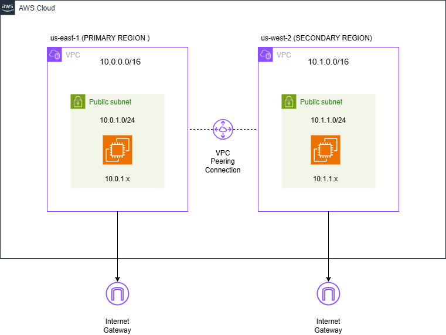

This project demonstrates how to create cross-region VPC peering using Terraform.
Two VPCs are deployed in different AWS regions and connected through a VPC Peering Connection, allowing EC2 instances in each VPC to communicate using their private IP addresses.

For simplicity and easier testing, the EC2 instances are deployed in public subnets with Internet Gateway access.

## Architecture Overview
```
                         AWS CLOUD

             Region: us-east-1 (Primary)
┌───────────────────────────────────────────────┐
│                                               │
│                VPC-A                          │
│              10.0.0.0/16                      │
│                                               │
│   Internet Gateway                            │
│         │                                     │
│   Route Table                                 │
│   10.0.0.0/16 → local                         │
│   10.1.0.0/16 → VPC Peering                   │
│   0.0.0.0/0   → IGW                           │
│         │                                     │
│   Public Subnet                               │
│   10.0.1.0/24                                 │
│         │                                     │
│   EC2 Instance                                │
│   Private IP: 10.0.1.x                        │
│                                               │
└───────────────────────┬───────────────────────┘
                        │
                        │  VPC Peering Connection
                        │  pcx-xxxxxxxx
                        │
┌───────────────────────┴───────────────────────┐
│                                               │
│            Region: us-west-2 (Secondary)      │
│                                               │
│                VPC-B                          │
│              10.1.0.0/16                      │
│                                               │
│   Internet Gateway                            │
│         │                                     │
│   Route Table                                 │
│   10.1.0.0/16 → local                         │
│   10.0.0.0/16 → VPC Peering                   │
│   0.0.0.0/0   → IGW                           │
│         │                                     │
│   Public Subnet                               │
│   10.1.1.0/24                                 │
│         │                                     │
│   EC2 Instance                                │
│   Private IP: 10.1.1.x                        │
│                                               │
└───────────────────────────────────────────────┘
```

## What This Demo Creates

```
terraform-vpc-peering
│
├── git.ignore
├── Readme.md
│
├── data.tf
├── ec2.tf
├── locals.txt
├── outputs.tf
├── peering.tf
├── providers.tf
├── terraform.tf
├── terraform.tfvars
├── terraform.tfvars.example
├── variables.tf
├── vpc.tf
```

```
terraform.tf -> Terraform settings and required providers

providers.tf -> AWS provider configuration

variables.tf -> Input variables

terraform.tfvars -> Variable values

data.tf -> Data sources (AMI, Availability Zones)

locals.tf -> Local values and reusable scripts

vpc.tf -> VPC resources, Subnet configuration, Internet gateways, Route tables and associations

peering.tf -> VPC peering resources

ec2.tf -> Security groups and EC2 instances

outputs.tf -> Terraform outputs
```

### Networking Components

1. **Two VPCs**:
   - Primary VPC in us-east-1 (10.0.0.0/16)
   - Secondary VPC in us-west-2 (10.1.0.0/16)

2. **Subnets**:
   - One public subnet in each VPC
   - Configured with auto-assign public IP

3. **Internet Gateways**:
   - One for each VPC to allow internet access

4. **Route Tables**:
   - Custom route tables with routes to internet and peered VPC
   - Routes for VPC peering traffic

5. **VPC Peering Connection**:
   - Cross-region peering between the two VPCs
   - Automatic acceptance configured

### Compute Resources

1. **EC2 Instance**:
   - One t2.micro instance in each VPC
   - Running Ubuntu
   - Apache web server installed (optional)
   - Custom web page showing VPC information (optional)

2. **Security Group**:
   - SSH access from anywhere (port 22)
   - ICMP (ping) allowed from peered VPC 
   - All TCP traffic allowed between VPCs (optional)

## Prerequisites

1. **AWS Account** with appropriate permissions


2. **Terraform** installed (version >= 1.0)

```
sudo chmod +x install-tf-awscliv2.sh
./install-tf-awscliv2.sh
```

3. **AWS CLI** configured with credentials

```
aws configure
```
*Access key and Access ID required.*

4. **SSH Key Pair** created in both regions 

### Creating SSH Key Pairs

```bash
# For us-east-1
aws ec2 create-key-pair --key-name vpc-peering-demo-useast1 --region us-east-1 --query 'KeyMaterial' --output text > vpc-peering-demo.pem

# For us-west-2
aws ec2 create-key-pair --key-name vpc-peering-demo-uswest2 --region us-west-2 --query 'KeyMaterial' --output text > vpc-peering-demo-west.pem

# Set permissions (on Linux/Mac)
chmod 400 *.pem
```
*These two keynames will be required to ssh instances*

```
vpc-peering-demo.pem
vpc-peering-demo-west.pem
```


## Setup Instructions 

### 1. Clone and change to project directory

```
git clone <repo-url>
cd terraform-vpc-peering-connection-setup/
```

### 2. Configure Variables
Copy the example tfvars file and update it:
```
cp terraform.tfvars.example terraform.tfvars
```

Edit `terraform.tfvars` and add your key pair name:
```
key_name = "vpc-peering-demo-useast1"
key_name = "vpc-peering-demo-uswest2"
```

### Deployment Steps

1. Initialize Terraform:

```
terraform init
```

2. Preview infrastructure changes:

```
terraform plan
```

3. Deploy resources:

```
terraform apply
```
Type `yes` when prompted.

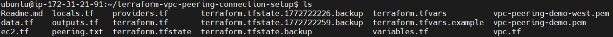
 
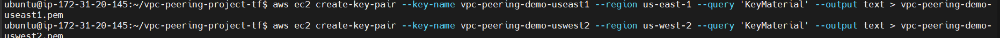

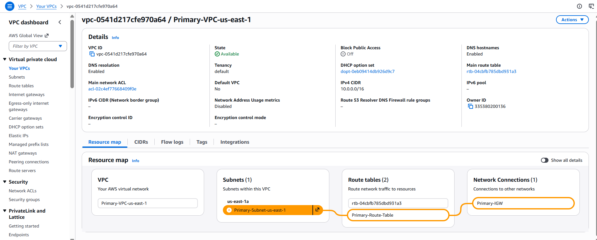

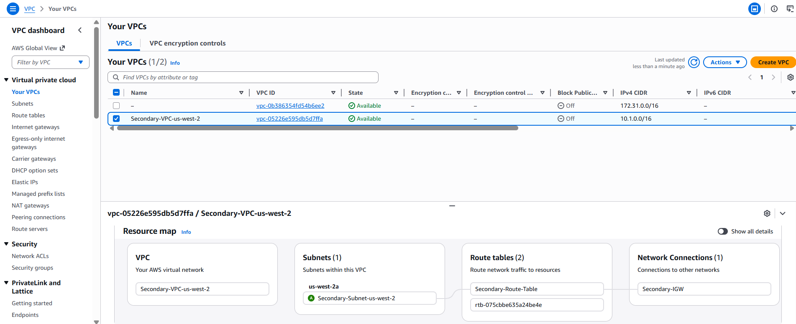

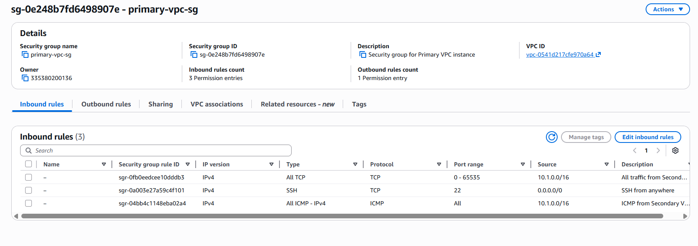

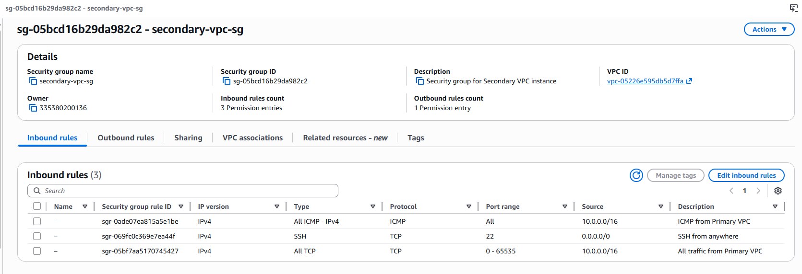

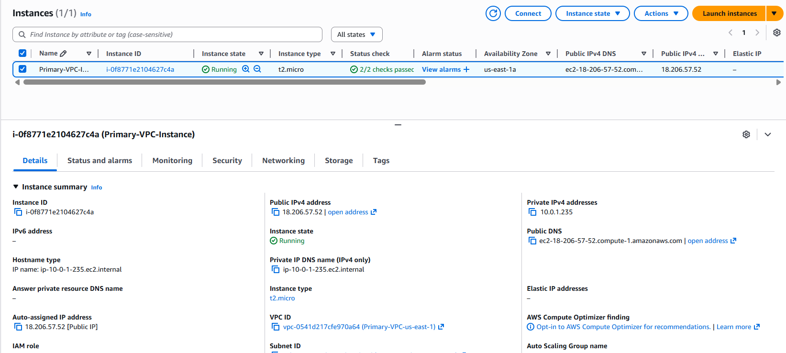

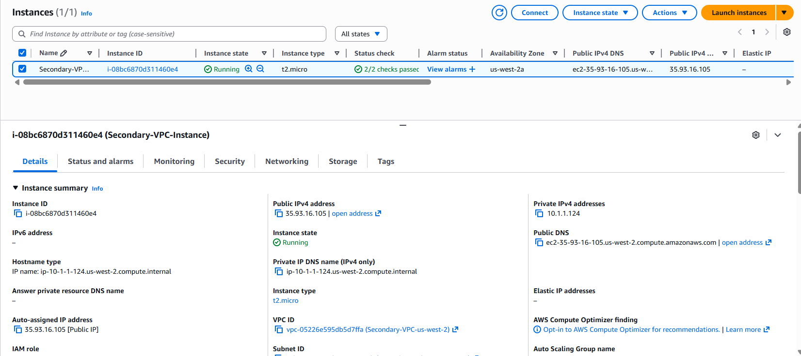

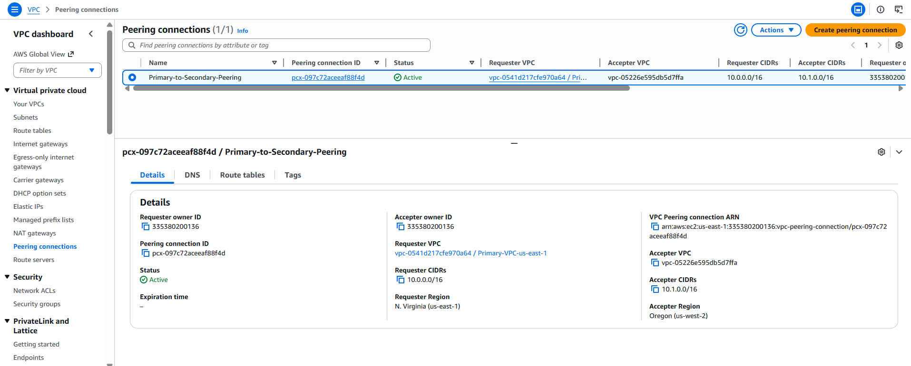

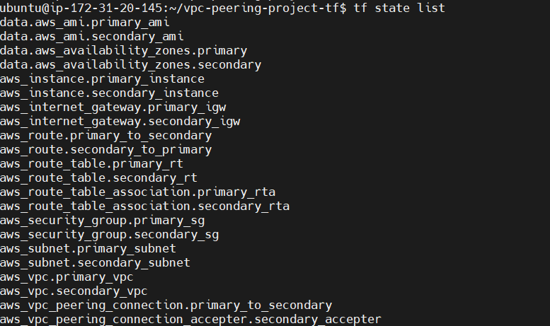

## Testing VPC Peering Connection

After the infrastructure is created, you can test the VPC peering connection:

### 1. Get Instance IPs

```
terraform output
```
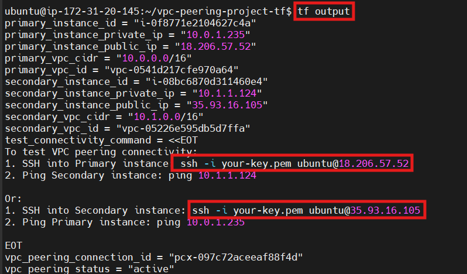

### 2. Test Connectivity from Primary to Secondary

```bash
# SSH into Primary instance
ssh -i vpc-peering-demo.pem ubuntu@<PRIMARY_PUBLIC_IP>

# Ping the Secondary instance using its private IP
ping <SECONDARY_PRIVATE_IP>

```
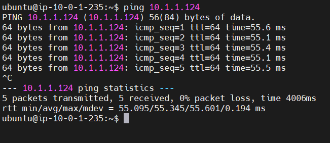

### 3. Test Connectivity from Secondary to Primary

```bash
# SSH into Secondary instance
ssh -i vpc-peering-demo-west.pem ubuntu@<SECONDARY_PUBLIC_IP>

# Ping the Primary instance using its private IP
ping <PRIMARY_PRIVATE_IP>

```
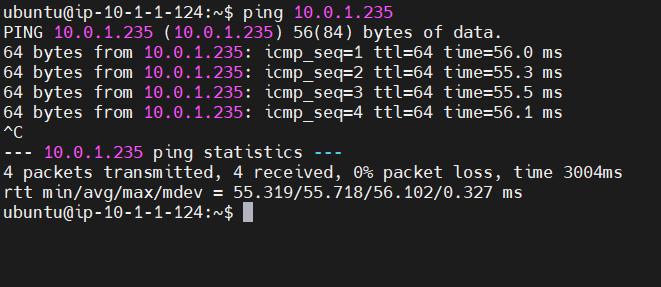


4. Destroy resources, after completion of project:

```
terraform destroy
```
Type `yes` when prompted.

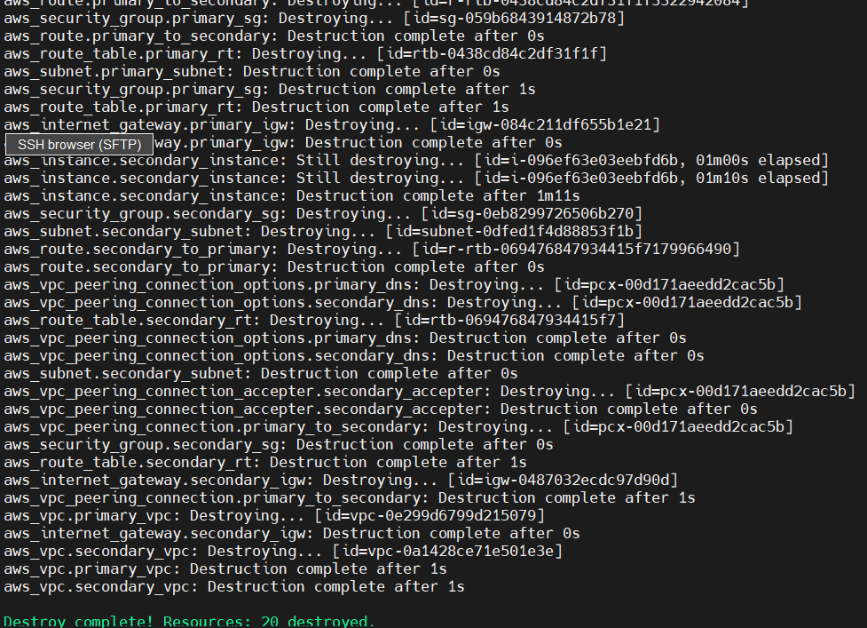

#### Key Concepts Demonstrated -

- Cross-region VPC peering

- CIDR block planning

- Route table configuration

- Security group communication

- Terraform multi-region providers

- EC2 connectivity using private IP addresses

#### Notes -

- VPC peering enables private communication between VPCs.

- VPC peering does not support transitive routing.

- One VPC cannot use another VPC’s Internet Gateway through peering.

#### Terraform Best Practices Learned -

- Use provider aliases for multi-region deployments

- Separate Terraform files by infrastructure type

- Avoid hardcoding AMI IDs

- Ensure route tables include peering routes

- Validate infrastructure using terraform plan before applying